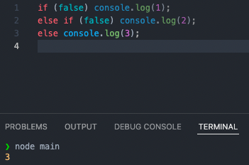

# 제어문 (Control flow statement)

제어문 : 실행 흐름을 인위적으로 제어하는 statement. 조건에 따라 코드 블록을 실행(조건문) or 반복 실행(반복문) 할 때 사용


## 블록문 (block statement)

0개 이상의 문을 중괄호{}로 묶은 것으로 코드 블록 또는 블록이라고 부른다.

자바스크립트는 블록문을 하나의 실행 단위로 취급


## 조건문 (Conditional Statement)

주어진 조건식의 평가 결과에 따라 코드 블록을 실행

### if ... else 문

조건식이 true면 if 문의 코드 블록이 실행되고, false면 else 문의 코드 블록 실행

```js
if(조건식){
  // 조건식 === true 면 실행 후 if문 종료
} else {
  // 조건식 === false 면 실행 (생략 가능)
}
```

여러 개의 조건식을 적용하고 싶으면 (코드 블록을 늘리고 싶으면) else if 문 사용

```js
if(조건식1){
  // 조건식1 === true 면 실행 후 if문 종료
} else if {
  // 조건식2 === true 면 실행 후 if문 종료
} else {
  // 조건식 1 && 조건식 2 === false 면 실행
}
```

* 참고) 한 번에 여러 조건을 확인하고 싶으면 조건식 내부에 &&, || 사용

만약 코드 블록 내 statement 가 하나라면 중괄호 생략 가능 (생략을 해도 각각 조건식에 적용될 코드 블록으로서 작용함)



if문은 삼항 조건 연산자로 바꿔쓸 수도 있음

```js
var x = 2;
var result;

if(x%2){ // Number 타입이 boolean 타입으로 암묵적 타입 변환
  result = '홀수'
} else {
  result = '짝수'
}
console.log(result) // 짝수

result = x % 2 ? '홀수' : '짝수';
console.log(result) // 짝수
```

삼항 연산자 중첩 가능

```js
var num = 2;

var result = num ? (num>0 ? '양수' : '음수') : "영" ;
console.log(result) // 양수
```

삼항 연산자를 왜 쓸까?

- if 문 보다 간단함
- 값처럼 사용할 수 있기 때문에 변수에 할당 가능 => JSX 에서 삼항 연산자가 사용 가능한 것과 연관? if 문은 값으로 할당이 안되기 때문에 jsx 에서 파싱, 렌더링 안됨


### switch 문

주어진 표현식을 평가하여 그 값과 일치하는 표현식을 갖는 case 문으로 실행 흐름을 옮김. (해당하는 case부터 쭉 실행)

```js
switch (표현식) {
  case 표현식1 : 표현식 === 표현식1 이면 실행
  	break;
  case 표현식1 : 표현식 === 표현식2 이면 실행
  	break;
  default : 일치하는 표현식이 없을 때 실행 (생략가능)
}
```

* default 값을 생략한 switch 문에서 일치하는 표현식이 없으면 그냥 아무 것도 실행되지 않는다.

#### 폴스루 (fall through)

case 문에 break 문을 사용하지 않으면 switch 문을 탈출하지 않고 일치하는 case 문부터 default 문까지 실행

의도적으로 사용하기도 함

```js
let month = 11;
let monthName;

swith (month) {
  case 1: monthName = 'January';
  case 2: monthName = 'February';
  case 3: monthName = 'March';
  case 4: monthName = 'April';
  case 5: monthName = 'May';
  case 6: monthName = 'June';
  case 7: monthName = 'July';
  case 8: monthName = 'August';
  case 9: monthName = 'September';
  case 10: monthName = 'October';
  case 11: monthName = 'November';
  case 12: monthName = 'December';
  default: monthName = 'Invalid month';
}

console.log(monthName); // Invalid month case 11 부터 실행되서 계속 재할당되어 defualt 문에서 최종 재할당
```

if ...else 문은 논리적 참, 거짓으로 실행할 때 사용, switch 문은 다양한 case에 따라 실행할 코드 블록을 결정할 때 사용


## 반복문 (loop statement)

조건식이 true 인 경우 코드 블록을 실행한 후, 다시 조건식으로 돌아와서 true 면 실행 반복

### for 문

조건식이 거짓으로 평가될 때까지 코드 블록 실행

```js
for (변수 선언문 또는 할당문 ; 조건식 ; 증감식){
  // 조건식이 참일 경우 반복 실행되는 블록
}
```

일반적인 for 문

```js
for (var i =0 ; i < 2 ; i++){
  console.log(i) // 0 1
}
```

for 문에 var 키워드를 썼을 때의 문제점 : var i 가 전역변수로 지정되기 때문에 생각지도 못한 문제가 발생할 수 있음


array[0] 은 당연히 0인줄 알았는데 뜬금없이 2 등장

array[0]이 실행되는 시점은 반복문이 다 돌고 전역변수 i에 2가 할당된 상태라 array 를 실행시키면 2만 출력

어떻게 개선함? let 쓰면 됨. block scope 라서 2가 할당된게 날라감

### while 문

주어진 조건식이 true 면 코드 블록 반복 실행. for 문은 반복 횟수가 명확할 때 주로 사용하고 while문은 반복 횟수가 불명확할 때 주로 사용

```js
var count = 0 
while (count < 3){
  console.log(count); // 0 1 2
  count++;
}
```

### do...while 문

코드 블록을 먼저 실행하고 조건식을 평가. 따라서 코드 블록은 무조건 한 번 이상 실행됨

```js
var count = 0
do {
	console.log(count); // 0 1 2
  count++;
} while (count < 3);
```

### break문

레이블문, 반복문, switch 문의 코드 블록을 탈출. 이외의 곳에서 break 문 사용하면 SyntaxError 발생

```js
// 레이블문 : 식별자가 붙은 문. 잘 안씀
foo : console.log('foo');
```

중첩된 for 문을 탈출할 때 사용

```js
// outer라는 식별자가 붙은 for 문
outer: for (let i = 0; i <3; i++) {
  for (let j = 0; j < 3; j++) {
    if ( i + j === 3) break outer; // i+j === 3이면 outer라는 식별자가 붙은 for 문 탈출
    console.log(`inner [${i}, ${j}]`);
  }
}
```

`break`문은 반복문, `switch`문에서도 사용

```js
let string = 'Hello'
let search = 'l'
let index;

// 문자열은 유사 배열이므로 for 문으로 순회할 수 있음
for (let i = 0; i < string.length; i++) {
  if (string[i] === search) {
    index = i;
    break; // 반복문 탈출
  }
}

console.log(index); // 2
```

### continue문

반복문의 코드 블록 실행을 현 지점에서 중단하고 반복문의 증감식으로 실행 흐름을 옮김. 반복문을 탈출하지는 않음

```js
let string = 'Hello world'
let search = 'l'
let count = 0;

for (let i = 0; i < string.length; i++) {
  // 'l' 아니면 현 지점에서 실행을 중단하고 반복문의 증감식(i++)으로 이동
  if (string[i] !== search) continue;
  count++ // continue 문이 실행되면 이 문은 실행되지 않음
}

console.log(count); // 3
```

counter 문을 사용하면 if 문 밖에 코드 작성 가능


# 타입 변환과 단축 평가

타입 변환은 개발자의 의도로 변환하는 명시적 타입 변환 (explicit coercion), 의도치 않게 변환되는 암묵적 타입 변환 (implicit coercion)

두 가지 모두 기존 변수 값을 재할당하여 변경하는 것이 아니라 기존 원시 값을 사용해서 다른 타입의 새로운 원시 값을 생성하는 것.

타입 변환이 왜 중요함? 자바스크립트는 개발자가 타입을 할당하는게 아닌 자바스크립트 엔진이 할당하니까 타입 변환 이해 못하면 예상치 못하게 오류 발생할 수도 있음


## 암묵적 타입 변환

개발자의 의도와는 상관없이 자바스크립트 엔진에 의해 데이터 타입이 강제 변환 되는 것

### 문자열 타입으로 변환

간단하게 + 연산자가 문자열 연결 연산자로 동작할 때 모든 피연산자 값을 문자열 타입으로 변환

템플릿 리터럴의 표현식 삽입은 표현식의 평가 결과를 문자열 타입으로 암묵적으로 변환

```js
`1 + 1 = ${1 + 1}` // "1+1=2"
```

```Js
// Number = > String
0 + '' // "0"
-0 + '' // "0"
1 + '' // "1"
-1 + '' // "-1"
NaN + '' // "NaN"
Infinity + '' // "Infinity"
-Infinity + ''  // "-Infinity"

// boolean = > String
true + '' // "true"
false + '' // "false"

// null = > String
null + '' // "null"

// undefined = > String
undefined + '' // "undefined"

// Symbol 타입은 안변함
(Symbol()) + '' // TypeError: Cannot convert a Symbol value to a string

// reference 타입
({}) + '' // "[object Object]"
Math + '' // "[object Math]"
[] + '' // ""
[10, 20] + '' // "10, 20"
(function(){}) + '' // "function(){}"
Array + '' // "function Array() { [native code] }"
```

### 숫자 타입으로 변환

산술 연산자를 사용할 때 숫자 타입이 아닌 피연산자는 모두 숫자 타입으로 변환

```js
// String
+'' // 0
+'0' // 0
+'1' // 1
+'string' // NaN

// Boolean 
+true // 1
+false // 0

// null
+null // 0

//undefined
+undefined // NaN

+Symbol() // TypeError: Cannot convert a Symbol value to a number

// referenc
+{} // NaN
+[] // 0
+[10, 20] // NaN
+(function(){}) // NaN
```

### boolean 타입으로 변환

if 문이나 for 문과 같은 제어문 또는 삼항 조건 연산자의 조건식을 true, false 로 나누어 평가되어야 하기 때문에 자바스크립트 엔진은 조건식의 평가 결과를 불리언 타입으로 변환

false 로 변환되는 값 : false, undefined, null, 0, -0, NaN, ' ' (빈 문자열)

```js
if ('') console.log('1');
if (true) console.log('2');
if (0) console.log('3');
if ('str') console.log('4');
if (null) console.log('5');                  

// 2 4
```


## 명시적 타입 변환

개발자의 의도에 따라 명시적으로 타입 변경. 표준 빌트인 생성자 함수 호출(Spring, Number, Boolean), 빌트인 메서드 사용, 암묵적 타입 변환 이용 등.

### 문자열 타입으로 변환

* String 생성자 함수를 new 연산자 없이 호출하는 방법

```js
// 숫자 타입 => 문자열 타입
Stiring(1); // "1"
String(NaN); // "NaN"
string(Infinity); // "Infinity"
// 불리언 타입 => 문자열 타입
String(true); // "true"
String(false); // "false"
```

* Object.prototype.toString 메서드를 사용하는 방법

```js
// 숫자 타입 => 문자열 타입
(1).toString(); // "1"
(NaN).toString(); // "NaN"
(Infinity).toString(); // "Infinity"
// 불리언 타입 => 문자열 타입
(true).toString(); // "true"
(false).toString(); // "false"
```

* 문자열 연결 연산자 이용하는 방법

```js
// 숫자 타입 => 문자열 타입
1 + '' // "1"
NaN + '' // "NaN"
Infinity + '' // "Infinity"
// 불리언 타입 => 문자열 타입
true + ''; // true
false + ''; // false
```

### 숫자 타입으로 변환

* `Number` 생성자 함수를 `new` 연산자 없이 호출하는 방법

```js
// 문자열 타입 => 숫자 타입
Number('0'); // 0
Number('-1');  // -1
Number('10.53'); // 10.53
// 불리언 타입 => 숫자 타입
Number(true); // 1
Number(false); // 0
```

* parseInt / parseFloat 함수를 사용하는 방법

```js
// 문자열 타입 => 숫자 타입
parseInt('0'); // 0
parseInt('-1'); // -1
parseFloat('10.53'); // 10.53
```

* `+` 단항 산술 연산자를 이용하는 방법

```js
// 문자열 타입 => 숫자 타입
+'0'; // 0
+'-1'; // -1
+'10.53'; // 10.53
//불리언 타입 => 숫자 타입
+true; // 1
+false; // 0
```

* `*` 산술 연산를 이용하는 방법

```js
// 문자열 타입 => 숫자 타입
'0' * 1; // 0
'-1' * 1; // -1
'10.53' * 1; // 10.53
// 불리언 타입 => 숫자 타입
true * 1; // 1
false * 1; // 0
```

### Boolean 타입으로 변환

* Boolean 생성자 함수를 `new` 연산자 없이 호출하는 방법

```js
// 문자열 타입 => 불리언 타입
Boolean('x'); // true
Boolean(''); // false
Boolean('false'); // true
// 숫자 타입 => 불리언 타입
Boolean(0); // false
Boolean(1); // true
Boolean(NaN); // false
Boolean(Infinity); // true
// null 타입 => 불리언 타입
Boolean(null); // false
// undefined 타입 => 불리언 타입
Boolean(undefined); // false
// 객체 타입 => 불리언 타입
Boolean({}); // true
Boolean([]); // true
```

* `!` 부정 논리 연산자를 두 번 사용하는 방법

```js
// 문자열 타입 => 불리언 타입
!!'x'; // true
!!''; // false
!!'false'; // true
// 숫자 타입 => 불리언 타입
!!0; // false
!!1; // true
!!NaN; // false
!!Infinity; // true
// null 타입 => 불리언 타입
!!undefined; // false
// 객체 타입 => 불리언 타입
!!{}; // true
!![]; // true
```


## 단축 평가 

#### 논리 연산자를 사용한 단축 평가

논리합 (||) / 논리곱(&&) 연산자 표현식은 2개의 피연산자 중 어느 한쪽으로 평가된다.

**단축 평가** : 표현식을 평가하는 도중에 평가 결과가 확정된 경우 나머지 평가 과정을 생략하는 것

```js
'Cat' && 'Dog' // "Dog"
```

&& : 두 개의 피연산자가 모두 true로 평가될 때 true 반환.  두번째 피연산자까지 Turthy 값일 때 논리 연산의 결과를 결정하는 두번째 피연산자 ('Dog') 반환

```js
'Cat' || 'Dog' // "Cat"
```

|| : 두 개의 피연산자 중 하나만 true로 평가되어도 true 반환. 첫번째 피연산자가 Turthy 값일 때 이미 논리 연산의 결과가 결정되기 때문에 첫번째 피연산자 ('Cat') 반환

| 단축 평가 표현식    | 평가 결과            |
| ------------------- | -------------------- |
| true \|\| anything  | 첫번째 피연산자 반환 |
| flase \|\| anything | 두번째 피연산자 반환 |
| true && anything    | 두번째 피연산자 반환 |
| false && anything   | 첫번째 피연산자 반환 |

* 어떤 조건이 Truthy 값일 때 논리곱(&&) 표현으로 if 문 대체

```js
var done = true;
var message = '';

//주어진 조건이 true일 때
if (done) message = '완료';

//done이 true라면 message에 '완료'할당
message = done && '완료';
console.log(message); //완료
```

* 어떤 조건이 Falsy 값일 때 논리합(||) 표현으로 if 문 대체

```js
var done = false;
var message = '';

//주어진 조건이 false일 때
if (done) message = '미완료'

//done이 false라면 message에 '미완료'할당
message = done || '미완료';
console.log(message); //미완료
```

​	참고) 삼항 연산자는 if ...else 문 대체 가능

```js
var done = true;
var message = '';

//if...else문
if (done) message = '완료'
else	  message = '미완료'
console.log(message); //완료

message = done ? '완료' : '미완료';
console.log(message); //완료
```


#### 그럼 단축평가는 어쩔 때 쓸까? (사실 잘 안쓰는 듯)

##### 객체를 가리키기를 기대하는 변수의 값이 null 또는 undefined 인지 확인하고 프로퍼티를 참조할 때

원래 객체를 가리키기를 기대하는 변수의 값이 null 이나 undefined 인 경우 객체의 프로퍼티를 참조하면 타입 에러 발생함

```js
var elem = null;
var value = elem.value; // TypeError: Cannot read property 'value' of null
```

단축 평가 사용하면 에러 발생 X

```JS
var elem = null;
// elem이 null이나 undefined와 같은 Falsy 값이면 elem으로 평가
// elem이 Truthy 값이면 elem.value로 평가
var value = elem && elem.value; // null
```

##### 함수 매개변수에 기본값을 설정할 때

함수를 호출할 때때 인수를 전달하지 않으면 매개변수에는 undefined가 할당. 이때 단축 평가를 사용해 매개변수의 기본값을 설정하면 undefined로 인해 발생할 수 있는 에러 방지

```js
// 단축 평가를 사용한 매개변수의 기본값 설정
function getStringLength(str) {
  str = str || '';
  return str.length;
}

getStringLength(); // 0
getStringLength('hi'); // 2

// ES6의 매개변수의 기본값 설정
function getStringLength(str = '') {
  return str.length
}

getStringLength(); // 0
getStrringLength('hi'); // 2
```


#### 옵셔널 체이닝 연산자

ES11에서 도입된 **옵셔널 체이닝 연산자 `?.`**는 좌항의 피연산자가 `null` 또는 `undefined`인 경우 `undefined`를 반환하고, 그렇지 않으면 우항의 프로퍼티 참조를 이어갑니다.

```js
var elem = null;

// elem이 null또는 undefined이면 undefined 반환, 그렇지 않으면 우항의 프로퍼티 참조를 이어감
var value = elem?.value;
console.log(value); // undefined
```

좌항 피연산자가 false로 평가되는 Falsy 값(`false`, `undefined`, `null`, `0`, `-0`, `NaN`, `''`) 이라도 `null`또는 `undefined`가 아니면 우항의 프로퍼티 참조를 이어감

```js
var str = '';

var length = str?.length;
console.log(length); // 0
```


#### null 병합 연산자

ES11에서 도입된 **null 병합 연산자 `??`**는 좌항의 피연산자가 `null` 또는 `undefined`인 경우 우항의 피연산자를 반환하고, 그렇지 않으면 좌항의 피연산자를 반환

```js
var foo = null ?? 'default string';
console.log(foo); // "default string"
```

좌항의 연산자가 false로 평가되는 Falsy 값이라도 `null` 또는 `undefined`가 아니면 좌항의 피연산자를 그대로 반환

```js
var foo = '' ?? 'default string';
console.log(foo); // ""
```

