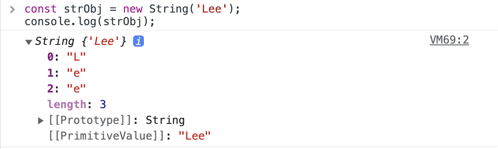
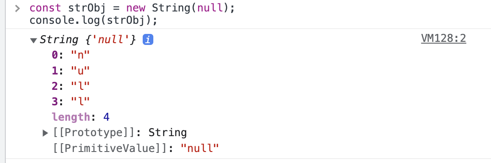
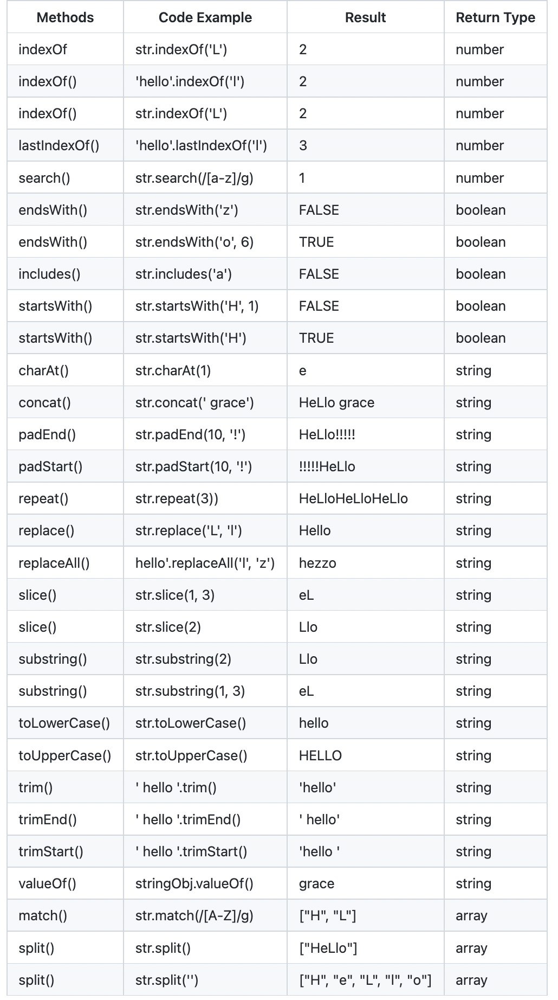
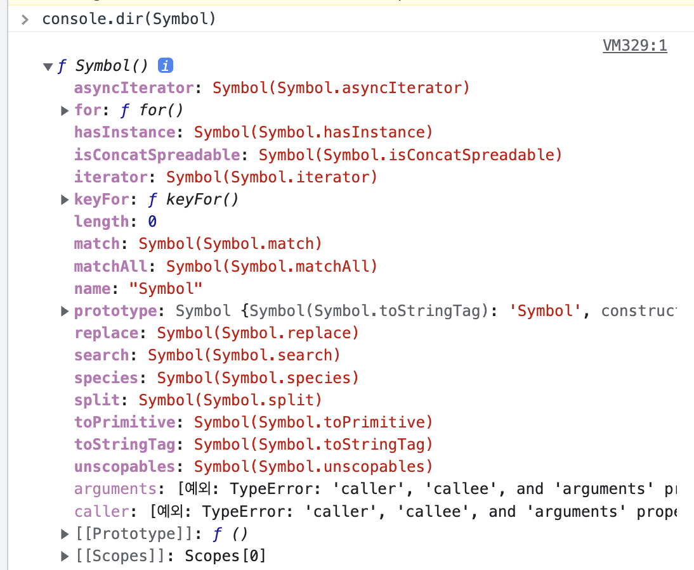

# String 생성자 함수

String 객체는 생성자 함수 객체입니다. class처럼 `new` 키워드를 통해서 객체를 생성할 수 있습니다.

```javascript
const strObj = new String('Lee');
console.log(strObj);
```

<details>
<summary>결과는?</summary>



</details>

요기서 주의할 점은 생성된 문자열은 배열과 유사하게 인덱스로 접근할 수 있는데, 문자열은 **원시값**이라서 변경할 수 없습니다. 근데 에러가 발생하지 않는다는 것이 문제!

```javascript
strObj[0] = 'S';
console.log(strObj); // 'Lee'
```

또한 생성자 함수의 인수로 전달한 값은 문자열로 **강제 변환**한 후 String 래퍼 객체를 생성합니다.

```javascript
const strObj = new String(null);
console.log(strObj);
```

<details>
<summary>결과는?</summary>



</details>

# String length 프로퍼티

```javascript
'Hello'.length; // 5
```

# String 메서드들

배열에는 원본 배열을 직접 변경하는 메서스들 예를 들어 push(), pop()... 와 같은 메서드들이 존재합니다.

String 객체는 배열과 다르게 원본 String 래퍼 객체를 직접 변경하는 메서드는 존재하지 않습니다.

**그래서 String 객체는 언제나, 늘, 항상 새로운 문자열을 반환합니다.**
문자열은 원시 값(변경 불가능)이기 때문에, String 래퍼 객체도 읽기 전용 객체로 제공되어서 메서드가 호출됩니다.

<details>
<summary>String.prototype.indexOf</summary>

> ES6 includes에 묻힌 친구

인수로 받은 문자열을 String에서 검색해서 첫 번째 인덱스를 반환합니다.
검색하지 못하면 -1을 반환합니다.

```javascript
// str: 찾을 문자열
// stratIndex: 찾기를 시작하는 인덱스
String.prototype.indexOf(str, stratIndex)
```

```javascript
const str = 'Hello World';

str.indexOf('l') // 2
str.indexOf('l', 3) // 3
str.indexOf('k') // -1
```

</details>

<details>
<summary>String.prototype.search</summary>

> search의 인수는 "정규 표현식" 입니다만?...

인수로 전달한 정규표현식과 일치하는 문자열의 **인덱스**를 반환합니다.

```javascript
// regExp: 전달할 정규 표현식
String.prototype.search(regExp)
```

```javascript
const str = 'Hello World';

str.search(/o/); // 4
str.search(/x/); // -1
```

</details>

<details>
<summary>String.prototype.includes (ES6)</summary>

인수로 전달받은 문자열이 포함되어 있는지 여부를 확인하는 메서드

```javascript
// str: 존재 여부를 확인할 문자열
// startIndex: 찾기를 시작하는 인덱스
String.prototype.includes(str, startIndex)
```

```javascript
const str = 'Hello World';

str.includes('ll'); // 4
```

</details>

<details>
<summary>String.prototype.startsWith (ES6)</summary>

인수로 전달받은 문자열로 시작하는지의 여부를 확인합니다.

```javascript
// str: 존재 여부를 확인할 문자열
// startIndex: 찾기를 시작하는 인덱스
String.prototype.startsWith(str, startIndex)
```

```javascript
const str = 'Hello World';

str.startsWith('He'); // true
str.startsWith('x'); // false
str.startsWith(' ', 5); // true
```

</details>

<details>
<summary>String.prototype.endsWith(ES6)</summary>

인수로 전달받은 문자열로 끝나는지 여부를 확인합니다.

```javascript
// str: 존재 여부를 확인할 문자열
// findStringLength: 검색할 문자열의 길이
String.prototype.endsWith(str, findStringLength)
```

```javascript
const str = 'Hello World';

str.endsWith('ld'); // true
str.endsWith('x'); // false

// hello까지 중에서 lo로 끝나는지 확인
str.endsWith('lo', 5); // true 
```

</details>

<details>
<summary>String.prototype.charAt</summary>

인수로 전달받은 인덱스에 위치한 문자를 검색해서 반환합니다.

```javascript
// index: 찾을 인덱스
String.prototype.charAt(index)
```

```javascript
const str = 'Hello World';

str.charAt(5); // ' '
str.charAt(6); // 'W'

// 인덱스를 벗어나면 빈 문자열을 반환
str.charAt(11); // ' '
```

</details>
<details>
<summary>String.prototype.substring</summary>

첫 번째 인수로 전달받은 인덱스에 위치하는 문자부터 두 번째 인수로 전달받은 인덱스에 위치하는 문자의 바로 이전 문자까지의 부분 문자열을 반환합니다.

```javascript
// startIndex: 시작 인덱스 (포함)
// endIndex: 끝 인덱스 (미포함)
String.prototype.substring(startIndex, endIndex)
```

```javascript
const str = 'Hello World';

str.substring(1, 4); // 'ell'
str.substring(1); // 'ello World'

// 자동적으로 바꿔줌
str.substring(4, 1); // 'ell'

// 0으로 인식
str.substring(-2); // 'Hello World'

// endIndex가 length를 넘어가면 length까지 자동 추론
str.substring(1, 100); // 'ello World'

str.substring(20); // ' '
```

</details>

<details>
<summary>String.prototype.slice</summary>

substring 메서드와 동일하게 동작하지만, slice 메서드의 인수는 음수를 전달할 수 있습니다.

```javascript
// startIndex: 시작 인덱스 (포함)
// endIndex: 끝 인덱스 (미포함)
String.prototype.slice(startIndex, endIndex)
```

```javascript
const str = 'Hello World';

// 음수를 전달하면 뒤에서 5번째부터 자른다.
str.slice(-5); // 'world'

// substring은 음수를 전달하면 0으로 인식
str.substring(-5); // 'Hello World'
```

</details>

<details>
<summary>String.prototype.toUpperCase</summary>

```javascript
const str = 'Hello World';

str.toUpperCase(); // 'HELLO WORLD'
```

</details>

<details>
<summary>String.prototype.toLowerCase</summary>

```javascript
const str = 'Hello World';

str.toLowerCase(); // 'hello world'
```

</details>

<details>
<summary>String.prototype.trim</summary>

대상 문자열 앞, 뒤에 공백 문자가 있을 경우 이를 제거한 문자열을 반환합니다.

```javascript
String.prototype.trim()
```

```javascript
const str = '  Hello World  ';

str.trim(); // 'Hello World'
```

`ECMAScript2021`부터 `trimStart`, `trimEnd`를 제공해서 사용할 수 있습니다.

```javascript
const str = '  Hello World  ';

str.trimStart(); // 'Hello World  '
str.trimEnd(); // '  Hello World'
```

</details>

<details>
<summary>String.prototype.repeat(ES6)</summary>

대상 문자열을 인수로 전달받은 정수만큼 반복해 연결한 새로운 문자열을 반환합니다.

```javascript
// count: 얼만큼 반복할건지? 기본값은 0
String.prototype.repeat(count)
```

```javascript
const str = 'Hello World';

str.repeat(); // ''
str.repeat(0); // ''
str.repeat(1); // 'Hello World'
str.repeat(2); // 'Hello WorldHello World'

// 2.5 -> 2
str.repeat(2.5); // 'Hello WorldHello World' 

// 음수는 에러납니다.
str.repeat(-1); // RangeError: Invalid count value
```

</details>

<details>
<summary>String.prototype.replace</summary>

대상 문자열에서 첫 번째 인수로 전달받은 문자열 또는 정규표현식을 검색하여 두 번째 인수로 전달한 문자열로 치환한 문자열을 반환합니다.

```javascript
// target: [정규표현식 or 문자열] 치환 대상을...
// to: ~로 바꾸고 싶다!
String.prototype.replace(target, to)
```

```javascript
const str = 'Hello World';

str.replace('Hello', 'Hyeonsu'); // 'Hyeonsu World'

const str2 = 'Hello Hello World';

// 처음으로 만난 문자열만 치환합니다.
str2.replace('Hello', 'Hyeonsu'); // 'Hyeonsu Hello World'

// 정규표현식을 사용하면 전부 치환가능합니다.
str2.replace(/hello/gi, 'Hyeonsu'); // 'Hyeonsu Hyeonsu World'
```

</details>

<details>
<summary>String.prototype.split</summary>

대상 문자열에서 첫 번째 인수로 전달한 문자열 또는 정규 표현식을 검색해서 문자열을 구분한 후 분리된 각 문자열로 이루어진 **배열**을 반환합니다.

```javascript
// standard: 나눌 기준 (정규표현식도 됩니다.)
// arrayLength: 배열의 길이를 지정할 수 있습니다.
String.prototype.split(standard, arrayLength)
```

```javascript
const str = 'Hi My name is Hyeonsu';

str.split(' ') // ['Hi', 'My', 'name', 'is', 'Hyeonsu']
str.split('') // ['H', 'i', ' ', 'M', ... 's', 'u']
str.split() // ['Hi My name is Hyeonsu']
str.split('', 3) // ['H', 'i', ' ']
```

</details>

### [String 메서드 Cheat sheet](https://github.com/JeongHaeun3263/javascript-string-methods-cheat-sheet)

> 알고리즘 문제 풀거나,,, 생각이 안날 땐 Cheat sheet를 기억하자!
> Array, String, Math, Number... Cheat sheet와 함께라면 나도 코딩 천재?




# Symbol

> 다른 값과 중복되지 않는 유일무이한 값
> 따라서 주로 이름의 충돌 위험이 없는 유일한 프로퍼티 키를 만들기 위해서 사용합니다.

# Symbol 생성

Array, String, Number, Boolean과 같은 것들은 리터럴 표기법으로 간단하게 생성할 수 있지만, `Symbol`은 함수를 호춣해서 생성해야 합니다.

```javascript
const symbol = Symbol();
console.log(typeof symbol); // symbol

// 심볼 값은 확인을 못한다.
console.log(symbol); // Symbol()

// 심볼은 `new` 연산자로 함께 호출하지 못한다.
new Symbol(); // TypeError: symbol is not a constructor
```

```javascript
const mySymbol1 = Symbol('Is Same Symbol?');
const mySymbol2 = Symbol('Is Same Symbol?');

console.log(mySymbol1 === mySymbol2) // false
```

# Symbol.for / Symbol.keyFor 메서드

```javascript
// my symbol 이라는 키를 가진 심볼을 검색하고 (심벌 레지스트리에서 검색)
// 가지고 있으면 해당 심볼을 반환, 없으면 새로 심볼 생성
const s1 = Symbol.for('my symbol');
const s2 = Symbol.for('my symbol');

console.log(s1 === s2) // true
```

```javascript
// my symbol 이라는 키를 가진 심볼을 검색하고 (심벌 레지스트리에서 검색)
// 가지고 있으면 해당 심볼을 반환, 없으면 새로 심볼 생성
const s1 = Symbol.for('my symbol');

const key1 = Symbol.keyFor(s1);

const s2 = Symbol('foo');

const key2 = Symbol.keyFor(s2);

// for 메서드를 통해서 레지스트리에 저장했기 때문에 출력이 됨
console.log(key1) // my symbol

// 단순 Symbol 함수를 호출해서 생성하면 심벌 레지스트리에 등록되지 않는다.
console.log(key2) // undefined
```

# Symbol은 어디서 사용할까?

```javascript
const Direction = {
	UP: 1,
	DOWN: 2,
	LEFT: 3,
	RIGHT: 4,
};
```

위의 예제는 1, 2, 3, 4 값 자체에는 의미가 없고, 상수 이름 자체에 의미가 있는데 해당 상수를 사용할 때 다른 변수 값과 겹칠 가능성이 있다.

```javascript
// 상수의 이름은 다르고, 의미도 다르지만 같은 값을 사용하고 있다.
// 예기치 못한 동작이 일어날 수 있음
const Point = {
	ONE: 1,
	TWO: 2,
	THREE: 3,
	FOUR: 4,
};
```

해결책은 Symbol을 사용해서 유일무이한 값으로 만드는 것

```javascript
// Object.freeze를 사용해 동결시킵시다.
const Direciton = Object.freeze({
	UP: Symbol('up'),
	DOWN: Symbol('down'),
	LEFT: Symbol('left'),
	RIGHT: Symbol('right'),
});
```

또한 프로퍼티 키로도 사용할 수 있습니다.
유일무이한 값이므로 미래에 추가될 어떤 프로퍼티 키와도 충돌할 위험이 없고 기존 프로퍼티와도 충돌하지 않습니다.

```javascript
const obj = {
	[Symbol.for('mySymbol')]: 1
};

obj[Symbol.for('mySymbol')]; // -> 1
```

또한 은닉이 필요한 프로퍼티 값이라면 심벌로 은닉할 수 있습니다.
왜냐하면 심벌은 for...in 문이나, Object.keys, Object.getOwnPropertyNames 메서드로 찾을 수 없거든요

```javascript
const obj = {
	[Symbol('mySymbol')]: 1
}

for (const key in obj) {
	console.log(key) // 아무것도 없어요
}

console.log(Object.keys(obj)) // []
console.log(Object.getOwnPropertyNames(obj)) // []
```

하지만 ES6에 도입된 `Object.getOwnPropertySymbols`로 찾을 수 있습니다. 그래서 완벽한 은닉은 아니에요

```javascript
const obj = {
	[Symbol('mySymbol')]: 1
}

const key = Object.getOwnPropertySymbols(obj)[0];

console.log(obj[key]) // 1
```

그리고 **표준 빌트인 객체**를 확장하는데도 심벌이 사용될 수 있습니다.
원래 표준 빌트인 객체를 변경하는 건 읽기 전용으로 사용하는게 좋습니다. 예기치 못한 동작을 일으킬 수 있으니까요. 굳이 추가를 하자면 심벌로 추가해서 기존의 빌트인 객체를 덮어 씌는것을 방지할 수 있습니다.

```javascript
Array.prototype[Symbol.for('my-sum')] = function () {
	return this.reduce((acc, cur) => acc + cur, 0);
};

[1, 2, 3][Symbol.for('my-sum')](); // 6
```

# Well-known Symbol

자바스크립트에서 기본으로 제공하는 빌트인 심벌 값이 있습니다.
빌트인 심벌 값은 Symbol 함수의 프로퍼티에 할당되어 있습니다.



자바스크립트가 기본 제공하는 빌트인 심벌 값을 ECMAScript 사양에서는 **Well-known Symbol**이라고 부르고, 자바스크립트 엔진 내부 알고리즘에 사용됩니다.
