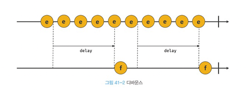
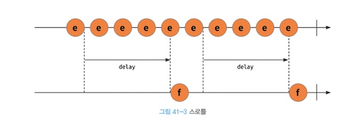

# 타이머

> 함수를 일정시간 뒤에 호출하고 싶다면 타이머 함수를 사용해서 호출해야 한다.

## 타이머 함수

- setTimeout
- setInterval

## 타이머 취소 함수

- clearTimeout
- clearInterval

## 특징

- 콜백 함수를 넘긴다
- 타이머 함수는 비동기 처리 방식으로 동작한다.

## setTimeout / clearTimeout

```js
const timeoutId = setTimeout(func|code[, delay, param1, param2, ...]);
```

- func | code: 타미어 완료 된 후 호출될 콜백 함수
- delay: ms단위, 생략 시 0이 기본 값
- params: 호출 콜백 함수에 인자가 필요하다면 인자를 넘길 수 있다.

```js
setTimeout(name => console.log(name), 1000, 'Jung');

// 1초후 Jung 출력
```

```js
// 생성된 타이머를 식별할 수 있는 timeout의 id값을 반환한다.
const timeoutId = setTimeout(func|code[, delay, param1, param2, ...]);

// 취소하고 싶다면 id 값을 넘기면 된다.
clearTimeout(timeoutId);
```

## setInterval / clearInterval

- setInterval도 setTimeout과 완전 동일합니다.
- 반복을 한다는 점만 다르고 나머지는 다 똑같습니다.

```js
const timerId = setInterval(func|code[, delay, param1, param2, ...]);
```

## 디바운스(debounce) & 쓰로틀(throttle)

> scroll, resize, input, movemove와 같은 이벤트들은 짧은 시간으로 정말 많이 실행이 되기 때문에 이런 이벤트들의 호출 빈도를 줄여서 성능을 높이기 위한 기법들

### 디바운스



우리가 form을 만들면 input change 이벤트를 달게 될텐데, 그러면 입력할 때마다 change 이벤트가 발동이 될텐데 그런 것의 성능을 최적화 하기 위한 기법

디바운스는 여러 이벤트가 발동하고, 이벤트가 일정시간동안 다시 발동되지 않는다면 그 때! 실행이 되는 기법이다.

[lodash debounce](https://github.com/lodash/lodash/blob/4.17.15/lodash.js#L10304)

```js
    function debounce(func, wait, options) {
      var lastArgs,
          lastThis,
          maxWait,
          result,
          timerId,
          lastCallTime,
          lastInvokeTime = 0,
          leading = false,
          maxing = false,
          trailing = true;

      if (typeof func != 'function') {
        throw new TypeError(FUNC_ERROR_TEXT);
      }
      wait = toNumber(wait) || 0;
      if (isObject(options)) {
        leading = !!options.leading;
        maxing = 'maxWait' in options;
        maxWait = maxing ? nativeMax(toNumber(options.maxWait) || 0, wait) : maxWait;
        trailing = 'trailing' in options ? !!options.trailing : trailing;
      }

      function invokeFunc(time) {
        var args = lastArgs,
            thisArg = lastThis;

        lastArgs = lastThis = undefined;
        lastInvokeTime = time;
        result = func.apply(thisArg, args);
        return result;
      }

      function leadingEdge(time) {
        // Reset any `maxWait` timer.
        lastInvokeTime = time;
        // Start the timer for the trailing edge.
        timerId = setTimeout(timerExpired, wait);
        // Invoke the leading edge.
        return leading ? invokeFunc(time) : result;
      }

      function remainingWait(time) {
        var timeSinceLastCall = time - lastCallTime,
            timeSinceLastInvoke = time - lastInvokeTime,
            timeWaiting = wait - timeSinceLastCall;

        return maxing
          ? nativeMin(timeWaiting, maxWait - timeSinceLastInvoke)
          : timeWaiting;
      }

      function shouldInvoke(time) {
        var timeSinceLastCall = time - lastCallTime,
            timeSinceLastInvoke = time - lastInvokeTime;

        // Either this is the first call, activity has stopped and we're at the
        // trailing edge, the system time has gone backwards and we're treating
        // it as the trailing edge, or we've hit the `maxWait` limit.
        return (lastCallTime === undefined || (timeSinceLastCall >= wait) ||
          (timeSinceLastCall < 0) || (maxing && timeSinceLastInvoke >= maxWait));
      }

      function timerExpired() {
        var time = now();
        if (shouldInvoke(time)) {
          return trailingEdge(time);
        }
        // Restart the timer.
        timerId = setTimeout(timerExpired, remainingWait(time));
      }

      function trailingEdge(time) {
        timerId = undefined;

        // Only invoke if we have `lastArgs` which means `func` has been
        // debounced at least once.
        if (trailing && lastArgs) {
          return invokeFunc(time);
        }
        lastArgs = lastThis = undefined;
        return result;
      }

      function cancel() {
        if (timerId !== undefined) {
          clearTimeout(timerId);
        }
        lastInvokeTime = 0;
        lastArgs = lastCallTime = lastThis = timerId = undefined;
      }

      function flush() {
        return timerId === undefined ? result : trailingEdge(now());
      }

      function debounced() {
        var time = now(),
            isInvoking = shouldInvoke(time);

        lastArgs = arguments;
        lastThis = this;
        lastCallTime = time;

        if (isInvoking) {
          if (timerId === undefined) {
            return leadingEdge(lastCallTime);
          }
          if (maxing) {
            // Handle invocations in a tight loop.
            clearTimeout(timerId);
            timerId = setTimeout(timerExpired, wait);
            return invokeFunc(lastCallTime);
          }
        }
        if (timerId === undefined) {
          timerId = setTimeout(timerExpired, wait);
        }
        return result;
      }
      debounced.cancel = cancel;
      debounced.flush = flush;
      return debounced;
    }
```

### 쓰로틀



디바운스는 여러 번의 이벤트에서 최종적으로 한 번 적용이 되는 느낌이라면 쓰로틀은 여러 번의 이벤트가 일어나는 중에 일정 시간동안 꾸준하게 한 번씩 일어나도록 하는 기법

그래서 자신이 정해놓은 시간을 주기로 한번씩 일어나게 하기 때문에 resize, scroll과 같은 이벤트가 잘 어울린다.

[lodash throttle](https://github.com/lodash/lodash/blob/4.17.15/lodash.js#L10897)

```js
    function throttle(func, wait, options) {
      var leading = true,
          trailing = true;

      if (typeof func != 'function') {
        throw new TypeError(FUNC_ERROR_TEXT);
      }
      if (isObject(options)) {
        leading = 'leading' in options ? !!options.leading : leading;
        trailing = 'trailing' in options ? !!options.trailing : trailing;
      }
      return debounce(func, wait, {
        'leading': leading,
        'maxWait': wait,
        'trailing': trailing
      });
    }
```

# AJAX

> Asynchronous JavaScript and XML

자바스크립트를 사용해서 브라우저가 서버에게 비동기 방식으로 데이터를 요청하고, 서버가 응답한 데이터를 수신해서 웹페이지를 동적으로 갱신하는 프로그래밍 방식

Ajax는 1999년 마이크로소프트가 개발한 XMLHttpRequest 객체를 기반으로 동작한다.

예전에는 HTTP 통신으로 html 전체를 받아서 새로 페이지를 이동한다면 다시 html을 받아서 리렌더링하는 방식으로 진행됐기 때문에 굉장히 비효율적이었다.

근데 ajax의 등작으로 서버로 html을 전부 받아서 리렌더링하는 것이 아니라 변경할 필요가 있는 부분만 부분적으로 렌더링 할 수 있게 됐다.

# JSON

> 클라이언트와 서버 간의 HTTP 통신을 위한 텍스트 데이터 포맷. 자바스크립트에서만 사용가능 한 것이 아니라 대부분의 프로그래밍 언어에서 사용 가능하다.

## JSON.stringify

> JSON 포맷의 데이터를 문자열로 바꾸는 자바스크립트 메소드

`JSON.stringify` 메서드는 배열도 문자열로 변환할 수 있다.

```js
const array = [
	{
		id: 1,
		text: 'one',
	},
	{
		id: 2,
		text: 'two',
	},
	{
		id: 3,
		text: 'three',
	}
];

// [{"id":1,"text":"one"},{"id":2,"text":"two"},{"id":3,"text":"three"}]
console.log(JSON.stringify(array));
```

## JSON.parse

> JSON 포맷의 문자열을 객체로 변환하는 자바스크립트 메서드

- 서버에서 클라이언트로 데이터를 제공하면 이 데이터는 문자열로 넘어온다.
- 이 문자열을 객체로 사용하려면 parse 메서드를 사용해야 한다.
- 배열이 JSON 포맷의 문자열로 변환되어 있으면 JSON.parse는 문자열을 배열로 변환한다.
- 배열의 요소가 객체인 경우에는 배열의 요소까지 객체로 전부 변환한다.

```js
const array = [
	{
		id: 1,
		text: 'one',
	},
	{
		id: 2,
		text: 'two',
	},
	{
		id: 3,
		text: 'three',
	}
];

// 문자열이었다가...
// [{"id":1,"text":"one"},{"id":2,"text":"two"},{"id":3,"text":"three"}]
console.log(JSON.stringify(array));

/*
객체로 변환된 모씁
0: {id: 1, text: 'one'}
1: {id: 2, text: 'two'}
2: {id: 3, text: 'three'}
*/
console.log(JSON.parse(JSON.stringify(array)));
```

# XMLHttpRequest

> 자바스크립트를 이용해서 HTTP 요청을 전송하려면 XMLHttpRequest 객체를 사용해야 한다. XMLHttpRequest는 Web API이다. HTTP 전송과 응답 수신을 위한 다양한 메서드와 프로퍼티를 제공한다.

- Web API 라서 브라우저 환경에서만 정상적으로 동작한다.

```js
const xhr = new XMLHttpRequest();
```

## XMLHttpRequest 객체의 프로퍼티와 메서드

[XMLHttpRequest 객체의 프로퍼티와 메서드](https://developer.mozilla.org/ko/docs/Web/API/XMLHttpRequest)

## HTTP 요청 순서

1. XMLHttpRequest.prototype.open 메서드로 HTTP 요청을 초기화한다.
2. 필요에 따라 XMLHttpRequest.prototyp.setRequestHeader 메서드로 특정 HTTP 요청의 헤더 값을 설정한다.
3. XMLHttpRequest.prototype.send 메서드로 HTTP 요청을 전송한다.

```js
const xhr = new XMLHttpRequest();

xhr.open('GET', '/users');

xhr.setRequestHeader('content-type', 'application/json');

xhr.send();
```

### XMLHttpRequest.open 메서드

> 서버에 전송할 HTTP 요청을 초기화한다.

- HTTP 메서드는 GET, POST, PUT, PATCH, DELETE 등이 있다.

## XMLHttpRequest.send 메서드

> open 메서드로 초기화된 HTTP 요청을 서버에 전송한다.

## XMLHttpRequest.prototype.setRequestHeader

> setRequestHeader 메서드는 특정 HTTP 요청의 헤더 값을 설정한다.

- setRequestHeader 메서드는 반드시 open 메서드를 호출한 이후에 호출해야한다.
- `Content-type`은 요청 몸체에 담아 전송할 데이터의 MIME 타입의 정보를 표현한다.

### 대표적인 MIME 타입

- text: text/plain, text/html, text/css, text/javascript
- application: application/json, application/x-www-form-urlencode
- multipart: multipart/formed-data

```js
xhr.setRequestHeader('accept', 'application/json');
```

## HTTP 응답 처리

> 보내는건 ok, 받는건 어떻게 처리할까요?

서버가 전송한 응답을 처리하려면 `XMLHttpRequest` 객체가 발생시키는 이벤트를 캐치해야 한다. onreadystatechange, onload, onerror 같은 이벤트 핸들러 프로퍼티를 갖고, readyState 프로퍼티 값이 변경된 경우 발생하는 readystatechange 이벤트를 캐치해서 HTTP 요청을 처리할 수 있다.

또는 readystatechange 이벤트 대신 load 이벤트를 캐치해도 좋다. load 이벤트는 HTTP 요청이 성공적으로 완료된 경우 발생한다.


```js
var xhr = new XMLHttpRequest();
console.log('UNSENT', xhr.readyState); // readyState will be 0

xhr.open('GET', '/api', true);
console.log('OPENED', xhr.readyState); // readyState will be 1

xhr.onprogress = function () {
    console.log('LOADING', xhr.readyState); // readyState will be 3
};

xhr.onload = function () {
    console.log('DONE', xhr.readyState); // readyState will be 4
};

xhr.send(null);
```
